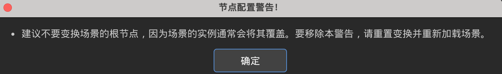

_process就是以帧来显示画面效果的 里面的delta根据帧数来控制的

_physic_process 就是固定的 里面的delta就是1/60

delta为  帧/秒    
玩家 A（60帧/秒）：电脑运行快，每帧间隔短，delta 是 1/60秒。每次转 90 * (1/60) = 1.5度。1秒钟执行60次，总共转 90度。
玩家 B（10帧/秒）：电脑卡顿，每帧间隔长，delta 是 1/10秒。每次转 90 * (1/10) = 9度。1秒钟执行10次，总共也是转 90度。
结果：无论电脑多卡，金币在现实世界中的旋转速度永远是一致的！delta 完美抹平了电脑性能的差异。

Input 是专门管理玩家按键的系统，get_vector 是它提供的一个查询方向的工具。Input.get_vector 就是告诉电脑：“去 Input 系统那里，用 get_vector 工具把方向给我拿过来。”
其中规定了设置的方向->左右上下


_unhandled_input节点就是处理用户不合理操作该场景下使用的方法
你可以直接把 _unhandled_input 理解为 “❌ 的另一种写法”：
方式 场景
点 ❌ 按钮 用户主动点关闭，明确操作 ✅
用 _unhandled_input 用户点空白处，系统帮他“自动点❌” 🤖
两者目标相同：关闭窗口
· ❌ 按钮：显式关闭（用户知道自己在关）
· _unhandled_input：隐式关闭（用户点外面，系统替用户关）
都是关闭弹窗，只是一个直接一个间接。
你把这个理解成“点空白 = 自动点❌”，就完全通了！


该问题是主场景下的初始位置与子节点的位置不一样  通常来说是单独移动了子节点的position  一般默认主场景的position在原点处


需要瞬时响应 → 用 _input
需要持续检测 → 用 Input

单发射击（用 _input）
```gdscript
func _input(event):
    if event.is_action_pressed("shoot"):
        shoot()  # 按一下，打一发
```
连发射击（用 Input）
```gdscript
func _process(delta):
    if Input.is_action_pressed("shoot"):
        shoot()  # 按住，每帧都打
        cooldown_timer  # 需要加射速限制
```
移动（用 Input）
```gdscript
func _physics_process(delta):
    var direction = Input.get_vector("left", "right", "up", "down")
    velocity = direction * speed  # 持续移动
```